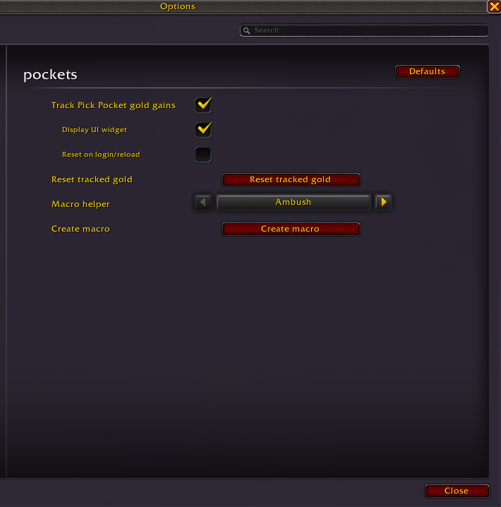
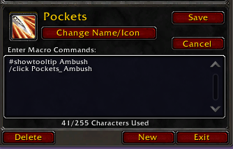

<div align="center">


# Pockets

Pick Pocket tracker addon for retail World of Warcraft.

</div>

## Overview

Pockets is a small addon for rogues who live off other people's coin. It quietly records every coin you lift and keeps a running total of your pick pocketed gold.

### Features

- **Tracking**: every pick pocket gold gain is recorded
- **On-screen total**: moveable/hideable pick pocket gold tracker
- **Combined follow-up**: optional QoL opener macros included
   * bundled spammable `Pockets_*` macros combine one opener with pick pocket
   * the macro delays the opener until the loot window closes
   * use with auto-loot enabled
   * use the *macro helper* or write it yourself

## Screenshots

**The on-screen gold total widget**


**Settings in the game's Options panel**



**The generated "Pockets" macro**




## How to use

1. Install the addon
2. Create an opener macro (optional)
3. ...
4. Profit


### Settings

- Reset your total any time with the **Reset tracked gold** button.
- Set **Reset on login/reload** to start each session fresh.


### How to use the macros

The addon supports the following list of opener macro commands:

- `/click Pockets_Ambush`
- `/click Pockets_Cheap_Shot`
- `/click Pockets_Garrote`
- `/click Pockets_Shadowstrike`
- `/click Pockets_Sap`


Option A: Use the macro helper. Pick your opener (e.g. Ambush or Sap) in Options and click **Create macro**. A "Pockets" macro is added to your macro list; assign it to a hotkey and you're set.

Option B: Add one of the supported opener commands to your own custom macro.


## Development

Pockets is open source. For bug reports and feature requests, please use the [issue tracker](https://github.com/gar-r/pockets/issues).

Local install requires the retail version of World of Warcraft (_retail_ build).

Use the included `Makefile`:

```sh
make clean install
```

